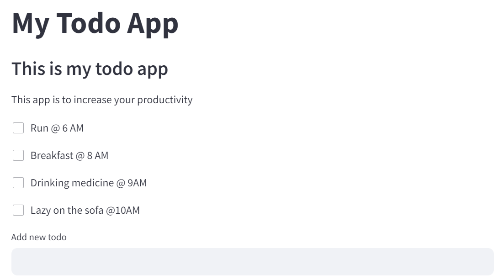
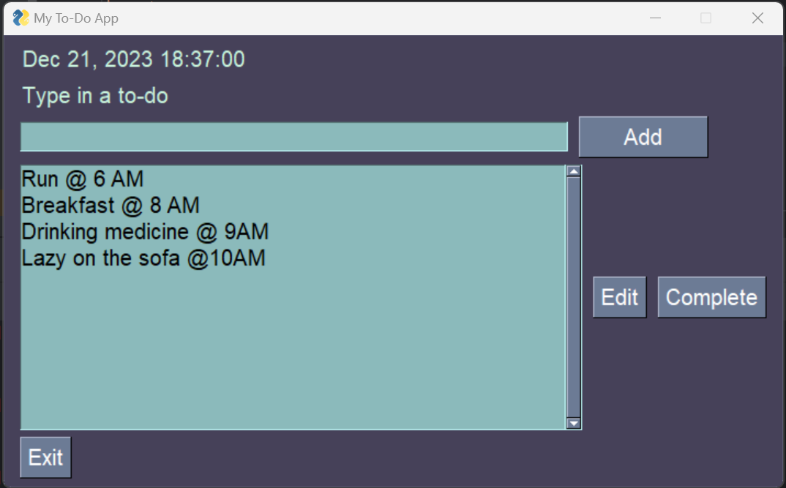

# Python Project of Todo List Application

## Project Description

**Problem :**  
Managing tasks and staying organized can be challenging in our daily lives. With the increasing demands of work, studies, and personal responsibilities, there is a need for a simple and effective tool to keep track of tasks.

**Challenges :**  
Build a Todo List Application that allows users to easily add, update, and delete tasks.

## Project Goal

To provide users with an efficient and user-friendly tool for managing their tasks, ultimately enhancing productivity and organization in their daily lives.

## Tools & Library Used

 &nbsp;

## Project Result

[Click here to get full code](https://github.com/nickenshidqia/List_Todo_App_Python_Project/blob/249ede6616d81ed268ac5a9144768bcee521ba81/web.py)

[Click here to check the website](https://nickenshidqia-list-todo-app-python-project-web-epk2mx.streamlit.app/)

### Todo List Web Based

This is Todo List Web application :

**Task Management:**

- Add Tasks:  
  Users should be able to easily add new tasks to the list. This involves providing a user-friendly interface to input task names and due dates.
- Task Deletion:  
  Once a task is completed or no longer relevant, users should have the ability to delete tasks from the list by checking the item from todo list.

### Todo List Graphical User Interface Based

This is Todo Graphical User Interface Based :

**Task Management:**  
The difference between **Todo List Web Based** and **GUI based** is in GUI application the user can edit the activity list, while in web based the user can't.

- Edit Tasks:  
  Enable users to modify existing tasks, including updating task details, and changing due dates
